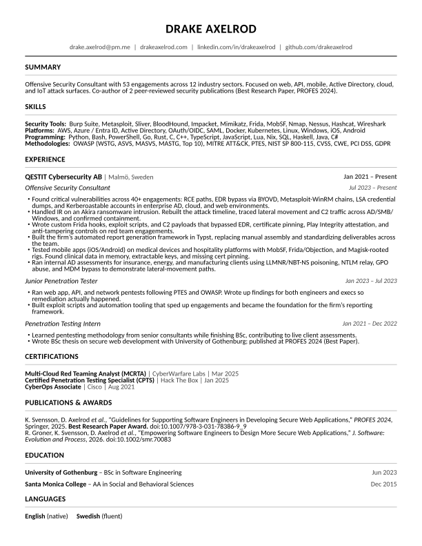

# Drake's Resume

<a style="margin: 0 auto; display: flex; justify-content: center; align-items: center; padding: 10px; width: 30%; background-color: #4CAF50; color: white; border: none; border-radius: 5px; cursor: pointer; margin-top: 10px;" href="https://github.com/drakeaxelrod/resume/raw/refs/heads/main/out/resume.pdf">Download Resume PDF</a>
